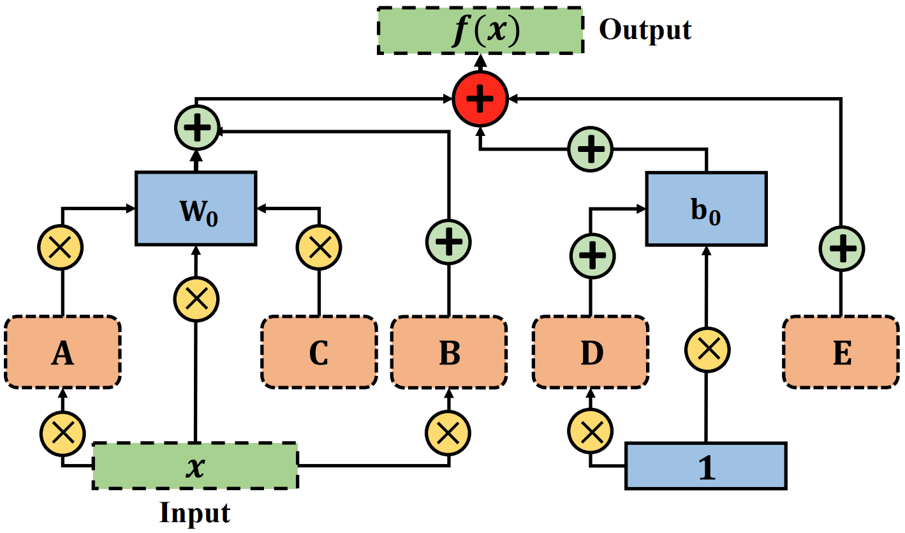

# One-for-All: Generalized LoRA for Parameter-Efficient Fine-tuning
:pushpin: Results on shareGPT fine-tuned LLM are coming soon; stay tuned!

This is an official PyTorch implementation of - One-for-All: Generalized LoRA for Parameter-Efficient Fine-tuning

> [**One-for-All: Generalized LoRA for Parameter-Efficient Fine-tuning**](https://arxiv.org/abs//2306.07967)<br>
> [Arnav Chavan](https://sites.google.com/view/arnavchavan/), [Zhuang Liu](https://liuzhuang13.github.io/), [Deepak Gupta](https://dkgupta90.github.io/), [Eric Xing](http://www.cs.cmu.edu/~epxing/), [Zhiqiang Shen](http://zhiqiangshen.com/)<br>MBZUAI, Transmute AI Lab, Meta, CMU

Enhancing Low-Rank Adaptation (LoRA), GLoRA employs a generalized prompt module to optimize pre-trained model weights and adjust intermediate activations, providing more flexibility and capability across diverse tasks and datasets.

<div align=center>

</div>

## Updates

### June '23 : Results on LLMs
The table below shows the performance on language tasks with pre-trained **LLaMA-7B** as the backbone and **Alpaca** dataset for finetuning. Our code is based on [Lit-LLaMA](https://github.com/Lightning-AI/lit-llama) and [lm-evaluation-harness](https://github.com/EleutherAI/lm-evaluation-harness) and will be released soon. 

We are now working on the **shareGPT** dataset for GLoRA-based fine-tuning. Stay Tuned!

| Model           | ARC (25-s) | HellaSwag (10-s) | MMLU (5-s) | TruthfulQA (MC) (0-s) | Average |
|-----------------|------------|------------------|------------|-----------------------|---------|
| LLaMA-7B        | 46.6       | 75.6             | 34.2       | 34.1                  | 47.6    |
| Falcon-7B       | 47.9       | 78.1             | 35.0       | 34.3                  | 48.8    |
| Alpaca-LoRA-7B  | 45.5       | 75.2             | 34.4       | 38.7                  | 48.4    |
| Alpaca-GLoRA-7B | 52.9       | 76.8             | 34.2       | 38.9                  | 50.7    |

## Getting Started

You will need [Python 3.8](https://www.python.org/downloads) and the packages specified in environment.yml.
We recommend setting up a [conda environment](https://docs.conda.io/projects/conda/en/latest/_downloads/843d9e0198f2a193a3484886fa28163c/conda-cheatsheet.pdf)
and install the packages there.

## Dataset

Please refer to [NOAH](https://github.com/ZhangYuanhan-AI/NOAH/#data-preparation) to download the dataset. Then move the dataset folders to `data/`.

Download the [pretrained ViT-B/16](https://storage.googleapis.com/vit_models/imagenet21k/ViT-B_16.npz) and place it in the root folder.

## Training
GLoRA follows a two-step process - 1. Supernet Training 2. Evolutionary Search

`LR=1e-4` works very well across datasets, `LORA_RANK` is the rank of LoRA modules across the supernet. In case the `SAVE_DIR` does not exists, a new directory is created. We train supernet for a default of 500 epochs, irrespective of the dataset.

```
python supernet.py
    --dataset DATASET
    --lr LR
    --model 'vit_base_patch16_224_in21k'
    --save_path SAVE_DIR
    --rank LORA_RANK
```

```
python evolution.py
    --dataset DATASET
    --save_path SAVE_DIR
    --load_path supernet training SAVE_DIR
    --param-limits MAX_PARAM(M)
    --rank LORA_RANK
```

## Citation

If you find our project is helpful, please feel free to leave a star and cite our paper:
```BibTeX
@misc{chavan2023oneforall,
      title={One-for-All: Generalized LoRA for Parameter-Efficient Fine-tuning}, 
      author={Arnav Chavan and Zhuang Liu and Deepak Gupta and Eric Xing and Zhiqiang Shen},
      year={2023},
      eprint={2306.07967},
      archivePrefix={arXiv},
      primaryClass={cs.LG}
}
```
    

## Acknowledgments
Part of the code is borrowed from [FacT](https://github.com/JieShibo/PETL-ViT/tree/main/FacT) and [AutoFormer](https://github.com/microsoft/Cream/tree/main/AutoFormer).


<!-- ## License

This project is licensed under the MIT License. -->
