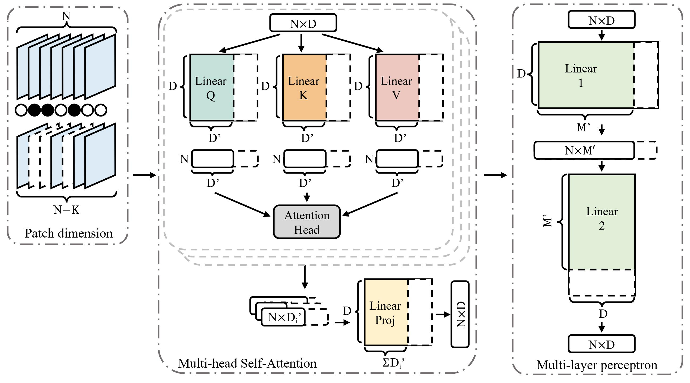

# ViT-Slimming

This is the official repository to the CVPR 2022 paper "[Vision Transformer Slimming: Multi-Dimension Searching in Continuous Optimization Space](https://arxiv.org/abs/2201.00814)" This repo is based on the training code in [Deit](https://github.com/facebookresearch/deit) and the tools in [timm](https://github.com/rwightman/pytorch-image-models).

<div align=center>

</div>

## Getting Started

You will need [Python 3.8](https://www.python.org/downloads) and the packages specified in _requirements.txt_.
We recommend setting up a [virtual environment with pip](https://packaging.python.org/guides/installing-using-pip-and-virtual-environments/)
and installing the packages there.

Install packages with:

```
$ pip install -r requirements.txt
```
## Data preparation
The layout of Imagenet data:
```bash
/path/to/imagenet/
  train/
    class1/
      img1.jpeg
    class2/
      img2.jpeg
  val/
    class1/
      img1.jpeg
    class2/
      img2.jpeg
``` 
## Configure and Run

All configurations concerning data, model, training, etc. can be called using commandline arguments.

### Searching
The search script offers many options to search compressed model from pretrained models.
Search flags:
- `--w1`: Attention Module sparsity weight
- `--w2`: MLP Module sparsity weight
- `--w3`: Patching Module sparsity weight

Here is a sample script to search on DeiT-S model with 4 GPUs
```
python3 -m torch.distributed.launch --nproc_per_node=4 --master_port=$RANDOM --use_env search.py --model deit_small_patch16_224 --batch-size 256 --data-set IMNET --data-path /path/to/imagenet --output_dir /path/to/save --pretrained_path /pretrained/model/path --w1 2e-4 --w2 5e-5 --w3 1e-4
```

### Retraining
The retrain script offers many options to retrain the searched models.
Retraining flags:
- `--budget_attn`: Percent of MHSA dimensions in compressed model
- `--budget_mlp`: Percent of MLP dimensions in compressed model
- `--budget_patch`: Percent of Patches in compressed model

Here is a sample script to retrain DeiT-S model with 70% budget on 4 GPUs
```
python3 -m torch.distributed.launch --nproc_per_node=4 --master_port=$RANDOM --use_env retrain.py --model deit_small_patch16_224 --batch-size 256 --data-set IMNET --data-path /path/to/imagenet --output_dir /path/to/save --searched_path /path/to/searched/model --budget_attn 0.7 --budget_mlp 0.7 --budget_patch 0.7
```

## Citation
Please cite our paper in your publications if it helps your research.

    @inproceedings{chavan2022vision,
      title={Vision Transformer Slimming: Multi-Dimension Searching in Continuous Optimization Space},
      author={Chavan, Arnav and Shen, Zhiqiang and Liu, Zhuang and Liu, Zechun and Cheng, Kwang-Ting and Xing, Eric},
      journal={Proceedings of the IEEE Conference on Computer Vision and Pattern Recognition (CVPR)},
      year={2022}
    }
    


## License

This project is licensed under the MIT License.
